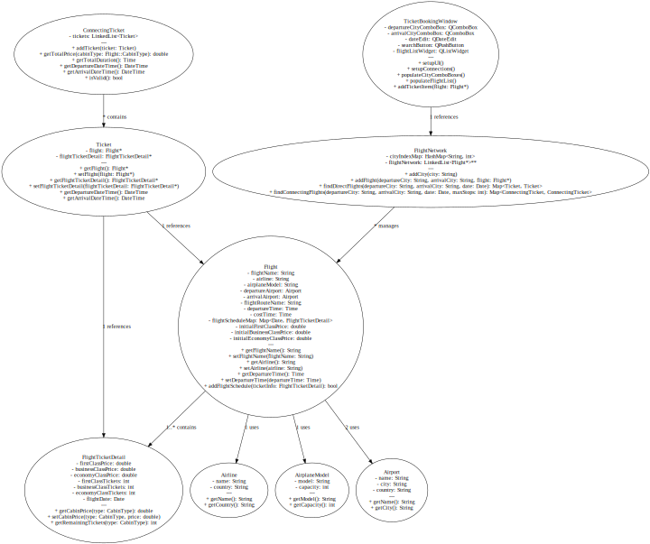

# Flight Booking System

## 概述

航班查询和机票订购系统是使用 C++、Qt 和 CMake 开发的跨平台应用程序。它提供了管理航班、订购机票、以及维护航班、机场和航空公司信息的功能。

## 特性

- **航班管理**：添加、修改或删除系统中的航班，定义航班时刻表和票价。
- **机票预订**：支持预订直达和联程航班，用户可选择经济舱、公务舱和头等舱。
- **机场和航空公司管理**：管理机场和航空公司信息，添加新机场和航空公司，支持与地图交互查找机场位置。
- **跨平台支持**：使用 Qt 开发，保证在 Windows、macOS 和 Linux 上的兼容性。

## 先决条件

- **Qt 6.7.2**
- **CMake**
- **VS Code** 或其他支持 CMake 项目的 IDE
- **C++ 编译器** (Linux 上使用 GCC/Clang，Windows 上使用 MSVC)

## 项目结构

```
.
├── CMakeLists.txt
├── data
│   ├── airline
│   │   └── airlines.txt
│   ├── airplanemodel
│   │   └── models.txt
│   ├── airport
│   │   └── airports.txt
│   ├── flight
│   │   └── flights.txt
│   └── user
│       └── users.txt
├── include
│   ├── data
│   │   └── datamanage.h
│   ├── FlightSystem
│   │   ├── Airline.h
│   │   ├── AirplaneModel.h
│   │   ├── Airport.h
│   │   ├── Flight.h
│   │   ├── FlightNetwork.h
│   │   ├── Passenger.h
│   │   ├── Point.h
│   │   ├── Ticket.h
│   │   └── Time.h
│   ├── Graph
│   │   ├── Edge.h
│   │   ├── Graph.h
│   │   ├── ListGraph.h
│   │   └── MatrixGraph.h
│   ├── LinkedList
│   │   ├── LinkedList.h
│   │   └── Link.h
│   ├── Map
│   │   ├── HashMap.h
│   │   └── Map.h
│   ├── Sorter.h
│   ├── String
│   │   └── String.h
│   ├── ui
│   │   ├── client
│   │   │   ├── LoginWindow.h
│   │   │   ├── MainWindow.h
│   │   │   ├── RegisterWindow.h
│   │   │   ├── TicketBookingWindow.h
│   │   │   └── WindowManager.h
│   │   └── server
│   │       ├── AirlineManageWindow.h
│   │       ├── AirplaneModelManageWindow.h
│   │       ├── AirportManageWindow.h
│   │       ├── FlightManageWindow.h
│   │       └── ServerWindow.h
│   └── User
│       └── User.h
├── README.md
├── resources
│   ├── icons
│   │   ├── airline.svg
│   │   ├── airplane.svg
│   │   ├── airport.svg
│   │   ├── app.svg
│   │   ├── eye_closed.svg
│   │   ├── eye_open.svg
│   │   ├── flight.svg
│   │   ├── personal.svg
│   │   ├── route.svg
│   │   └── service.svg
│   ├── pages
│   │   ├── airline
│   │   │   ├── addAirline.css
│   │   │   ├── addAirline.html
│   │   │   └── addAirline.js
│   │   ├── airport
│   │   │   ├── addAirport.css
│   │   │   ├── addAirport.html
│   │   │   └── addAirport.js
│   │   ├── map.css
│   │   ├── map.html
│   │   ├── map.js
│   │   └── plugins
│   │       └── leaflet.curve.js
│   └── resources.qrc
└── src
    ├── data
    │   └── datamanage.cpp
    ├── FlightSystem
    │   ├── Airline.cpp
    │   ├── AirplaneModel.cpp
    │   ├── Airport.cpp
    │   ├── Flight.cpp
    │   ├── FlightNetwork.cpp
    │   ├── Point.cpp
    │   ├── Ticket.cpp
    │   └── Time.cpp
    ├── main.cpp
    ├── String
    │   └── String.cpp
    ├── ui
    │   ├── client
    │   │   ├── LoginWindow.cpp
    │   │   ├── MainWindow.cpp
    │   │   ├── RegisterWindow.cpp
    │   │   ├── TicketBookingWindow.cpp
    │   │   └── WindowManager.cpp
    │   └── server
    │       ├── AirlineManageWindow.cpp
    │       ├── AirplaneModelManageWindow.cpp
    │       ├── AirportManageWindow.cpp
    │       ├── FlightManageWindow.cpp
    │       └── ServerWindow.cpp
    └── User
        └── User.cpp
```

## 构建和运行

### 使用 CMake 构建

1. **克隆仓库**：
   ```sh
   git clone https://github.com/yourusername/flight-booking-system.git
   cd flight-booking-system
   ```
2. **创建构建目录**：
   ```sh
   mkdir build
   cd build
   ```
3. **运行 CMake**：
   ```sh
   cmake ..
   ```
4. **编译项目**：
   ```sh
   cmake --build .
   ```

### 运行应用程序

- 构建完成后，可以在 `build` 目录中找到可执行文件。使用以下命令运行：
  ```sh
  ./flight-booking-system
  ```

## 使用说明

- **航班管理**：导航到应用程序中的“航班管理”部分添加新航班，可以设置航班的出发和到达机场、时间以及不同舱位的初始票价。
- **机票预订**：使用“机票预订”部分来搜索可用航班，选择直达或联程航班，并在所需日期预订机票。

## 实现细节

- **航班时刻表管理**：`Flight` 类管理航班信息，而 `FlightTicketDetail` 则存储每个航班日期的票务信息。
- **自定义容器**：项目使用了自定义实现的数据结构，如 `LinkedList` 和 `Map`，而非 C++ STL，从而在特定使用场景下提供了更多控制和优化的性能。
- **用户界面**：UI 使用 Qt Widgets 构建，并集成了 Web 技术用于地图交互界面。

## UML 类图

以下是主要类的 UML 类图，展示了类之间的关系：




### 主要类设计

1. **Flight 类**

   - 管理航班信息，包括航班名称、航空公司、机型、出发和到达机场、航线名称、起飞时间、飞行时间、以及舱位和票价信息。
   - 提供了添加和移除航班时刻表的方法。

2. **Ticket 类**

   - 储存航班指针 (`Flight*`) 和航班票务详情 (`FlightTicketDetail*`)。
   - 提供获取出发和到达时间的方法，以及操作符重载来进行比较。

3. **ConnectingTicket 类**

   - 管理联程航班的多个 `Ticket` 对象。
   - 提供了计算总价、总时长、获取出发和到达时间的方法。

4. **FlightNetwork 类**

   - 管理整个航班网络，储存多个城市之间的航班信息。
   - 提供了添加城市、添加航班、查找直达和联程航班的方法。
   - 航班网络使用 `LinkedList<Flight*>**` 的矩阵结构来存储不同城市之间的航班列表。
   - **主要方法**：
     - `addCity(const String& city)`：添加新的城市节点。
     - `addFlight(const String& departureCity, const String& arrivalCity, Flight* flight)`：添加航班连接。
     - `findDirectFlights(const String& departureCity, const String& arrivalCity, const Date& date)`：查找两个城市之间的直达航班。
     - `findConnectingFlights(const String& departureCity, const String& arrivalCity, const Date& date, int maxStops)`：查找联程航班，支持设定最大中转次数。

### 用户界面设计

1. **MainWindow 类**

   - 应用程序的主窗口，负责管理登录、注册、航班管理等功能模块的切换。

2. **TicketBookingWindow 类**

   - 负责机票预订界面的实现，允许用户搜索航班并预订机票。
   - 支持搜索直达和联程航班，显示航班详细信息（如出发到达时间、价格等）。

3. **管理界面**

   - 包括机场管理、航班管理、机型管理等模块，每个模块都有专门的窗口类，如 `AirportManageWindow`、`FlightManageWindow`，用于管理相关信息。
